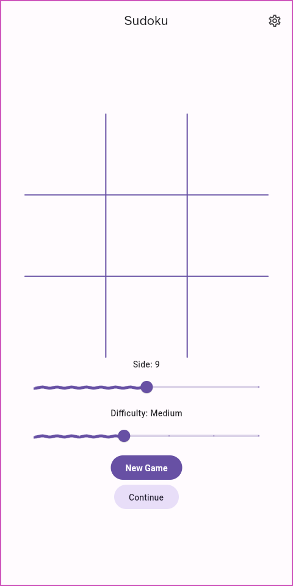
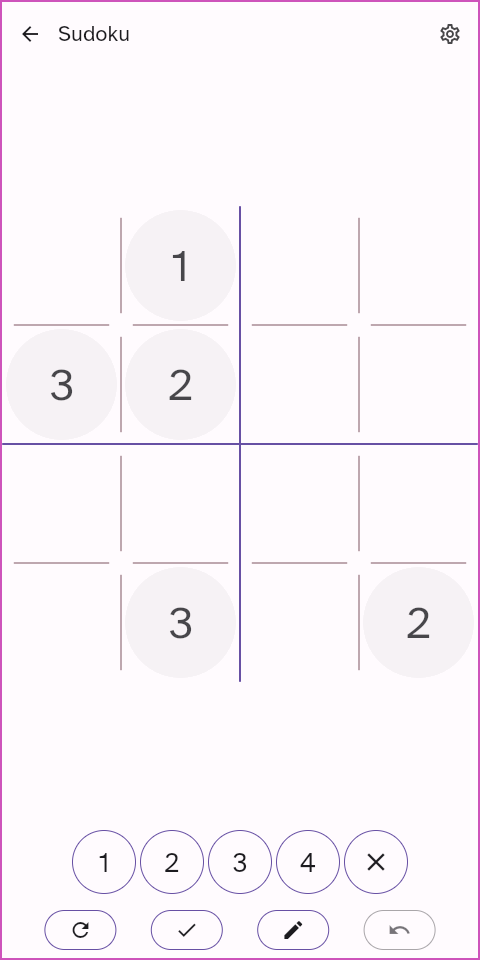
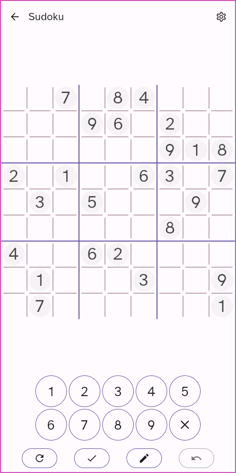
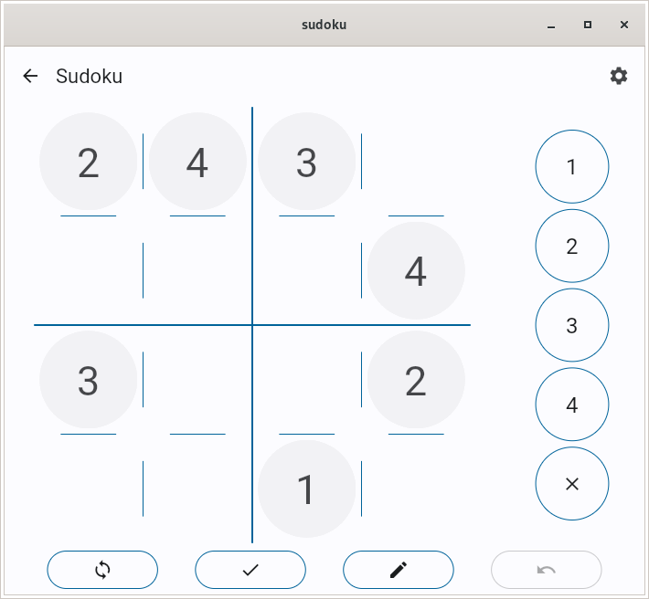
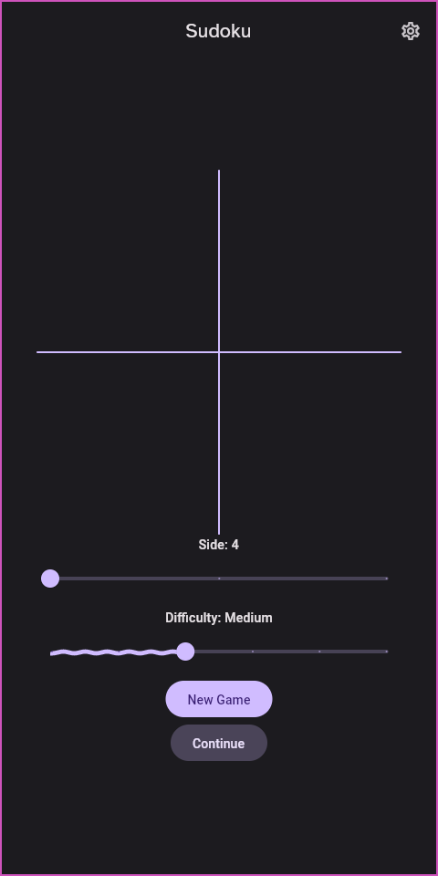
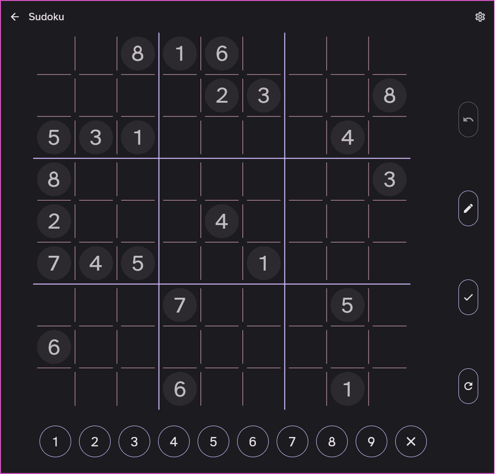
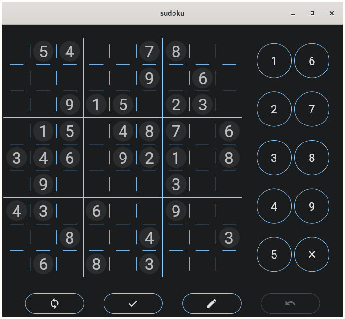
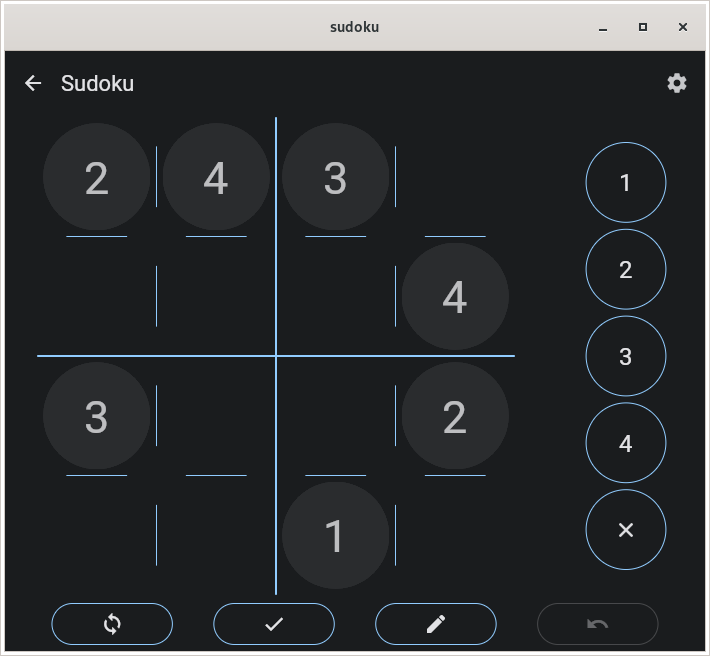

# sudoku

An beautiful Sudoku made with Flutter and Dart using the BLoC pattern. It uses my very own [material_widgets](https://github.com/KalilDev/material_widgets) , [material_you](https://github.com/KalilDev/material_you), [flutter_monet_theme](https://github.com/KalilDev/material_theme_reverse/tree/master/dart/flutter_monet_theme), [monet_theme](https://github.com/KalilDev/material_theme_reverse/tree/master/dart/monet_theme) and [palette_from_wallpaper](https://github.com/KalilDev/palette_from_wallpaper) packages for an Material Design 3 look and feel.

## Running

You can download an release APK on the [releases page](https://github.com/KalilDev/sudoku/releases)

The Flutter web version is deployed on github-pages and can be accessed [Here](https://kalildev.github.io/sudoku/index.html)

## Screenshots

### Light
</img>
</img>
</img>
</img>
</img>
</img>
</img>
</img>

### Dark
</img>
</img>
</img>
</img>
</img>
</img>
</img>
</img>