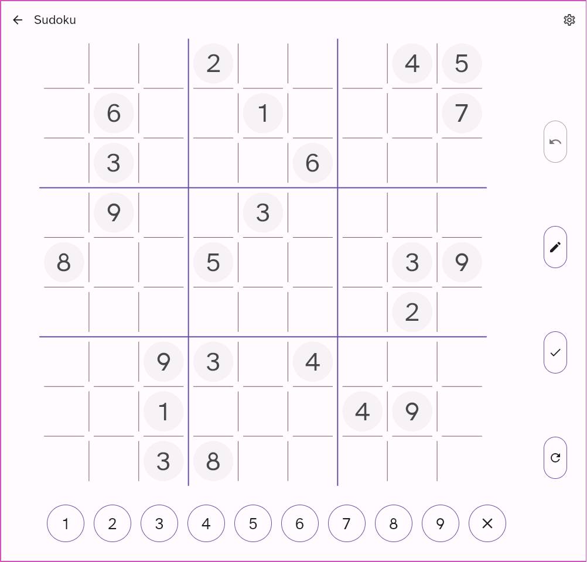
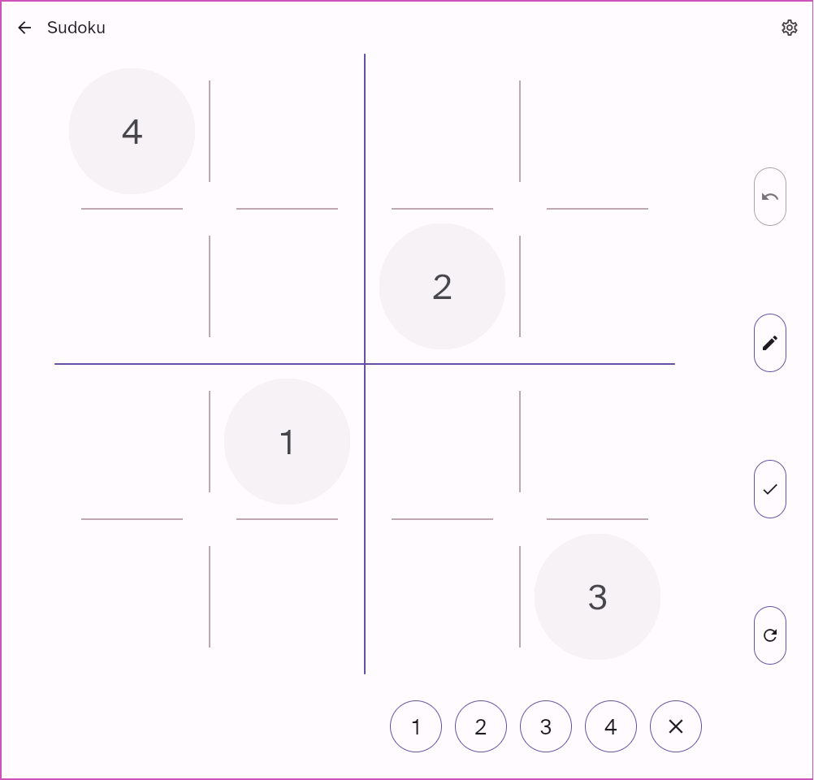
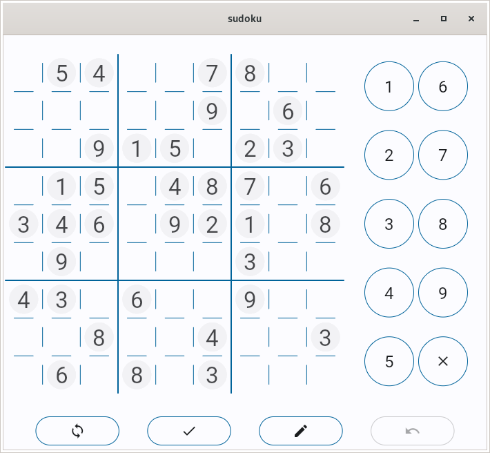
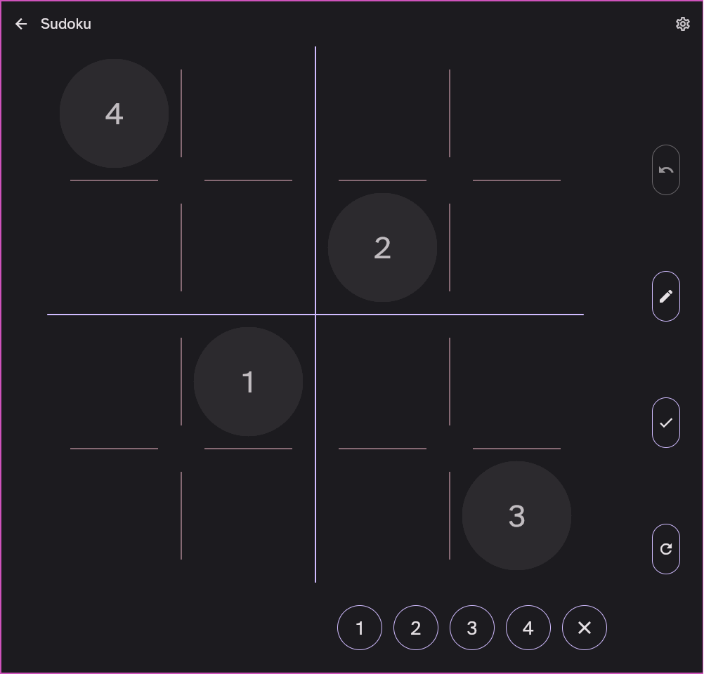

# sudoku

An beautiful Sudoku made with Flutter and Dart using the BLoC pattern.

## Running

You can download an release APK on the [releases page](https://github.com/KalilDev/sudoku/releases)

The Flutter web version is deployed on github-pages and can be accessed through these links:

- [Dom version](https://kalildev.github.io/sudoku/index.html)
- [CanvasKit version](https://kalildev.github.io/sudoku/index_skia.html)

## Screenshots

### Light
</img>
</img>
</img>
</img>
</img>
</img>
</img>
</img>

### Dark
</img>
</img>
</img>
</img>
</img>
</img>
</img>
</img>