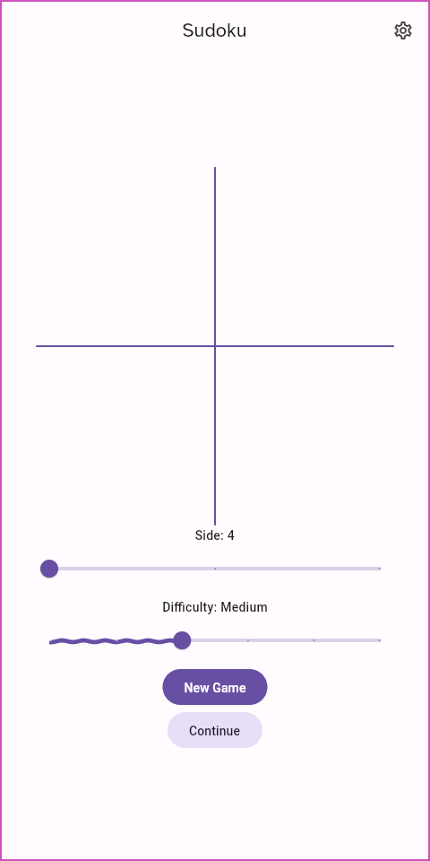
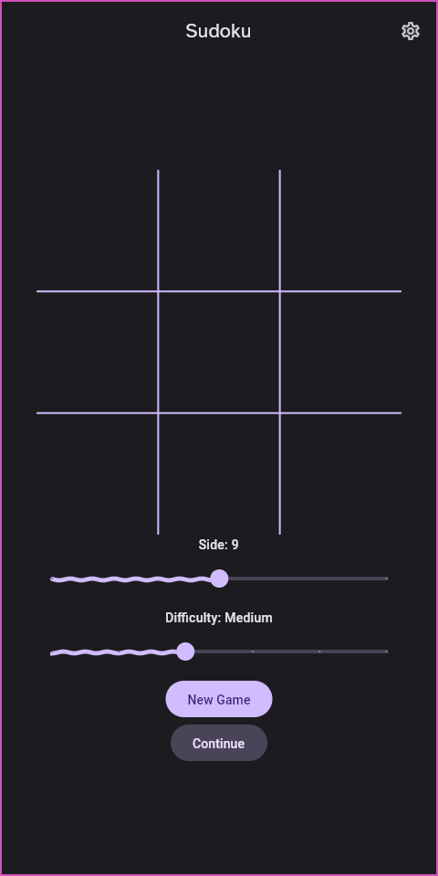
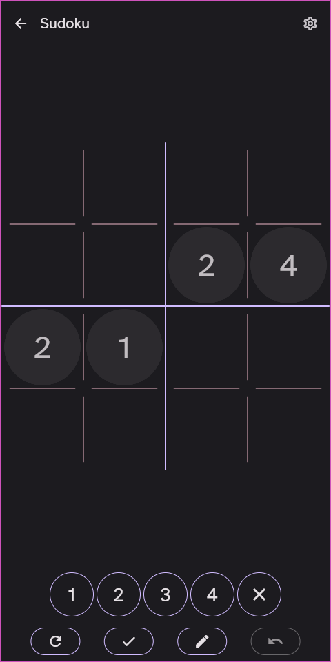
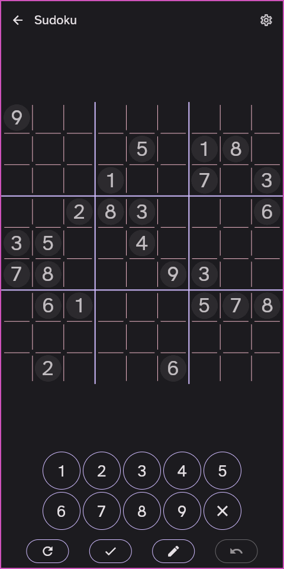

# Sudoku

An beautiful and customizable sudoku app made in flutter by Pedro Kalil.

## Packages used

Most packages are made by me and form an cohesive ecosystem for programming in a
reactive/functional style without mutation and with rich ui elements that adapt
to the user's wallpaper following the Material You design language

- [libsudoku](https://www.github.com/kalildev/libsudoku), made in C for the best
  performance by me, and used in the app using dart:ffi.
- [utils](https://www.github.com/kalildev/utils), made by me.
- [value_notifier](https://www.github.com/kalildev/value_notifier), made by me.
- [hive](https://pub.dev/packages/hive), which i contributed to by migrating to
  NNDB and adding built_value support.
- [synchronized](https://pub.dev/packages/synchronized).
- [material_widgets](https://www.github.com/kalildev/material_widgets), made by
  me, which in turn uses.
  * [palette_from_wallpaper](https://github.com/KalilDev/palette_from_wallpaper)
  , made by me.
  * [material_you](https://github.com/KalilDev/material_you), made by me.
  * [flutter_monet_theme](https://github.com/KalilDev/monet_theme), made by me.
  * [monet_theme](https://github.com/KalilDev/monet_theme), made by me.
- [path_provider](https://pub.dev/packages/path_provider).
- [sudoku_core](https://github.com/KalilDev/sudoku/tree/old/sudoku_core), made
  by me for the previous sudoku app game.
- [adt_generator](https://github.com/KalilDev/adt_generator), made by me,and
  also
  * [adt_annotation](https://github.com/KalilDev/adt_generator)
- [flutter_colorpicker](https://pub.dev/packages/flutter_colorpicker).
- [google_fonts](https://pub.dev/packages/google_fonts).

## Architecture

The details of the how's and why's of this app's are available in
[architecture.md](architecture.md)

## Screenshots

### Light
</img>
</img>
</img>
</img>
</img>
</img>

### Dark
</img>
</img>
</img>
</img>
</img>
</img>

## Running the app

Android apks are available at the
[releases page](https://github.com/KalilDev/sudoku/releases), and will soon be
uploaded to the Play Store.

The app is also acessible on the
[website](https://kalildev.github.io/sudoku/index.html), although it is slower.